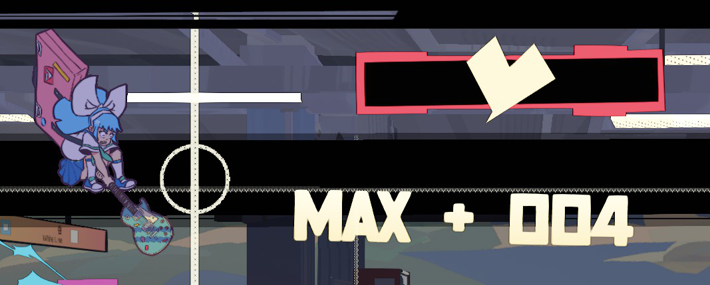

# Customizable Accuracy Text

This mod for UNBEATABLE allows you to change the accuracy text and various options regarding it. It also allows you to add special text for maximum score hits.

## Compatible game versions
- UNBEATABLE (tested with `v1.6.1`)

## Requirements

- [BepInEx](https://github.com/BepInEx/BepInEx)

## Installation

1. Download and install BepInEx into your game directory (if you use [CustomBeatmaps](https://github.com/gold-me/CustomBeatmapsV4), you have this installed already)
2. Run the game, then close it
3. [Download this mod](https://github.com/Zachava96/CustomizableAccuracyText/releases)
4. Merge the BepInEx folder from this mod with the BepInEx folder in your game directory
5. Run the game

## Configuration

The default configuration makes no visible changes to the game. Please see the `BepInEx/config/net.zachava.customizableaccuracytext.cfg` file for details on configuration.
